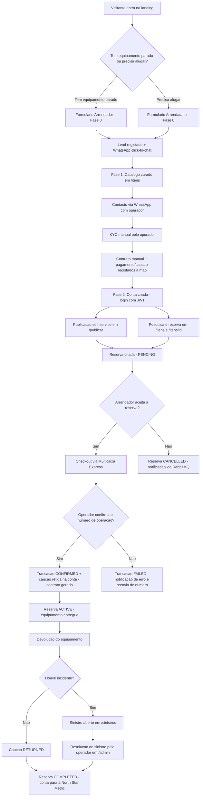
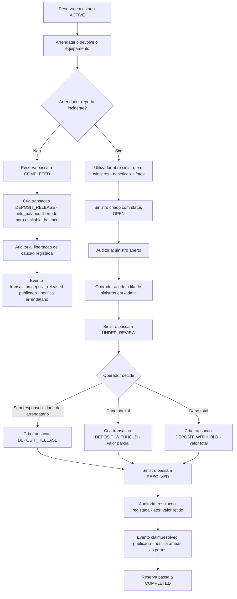
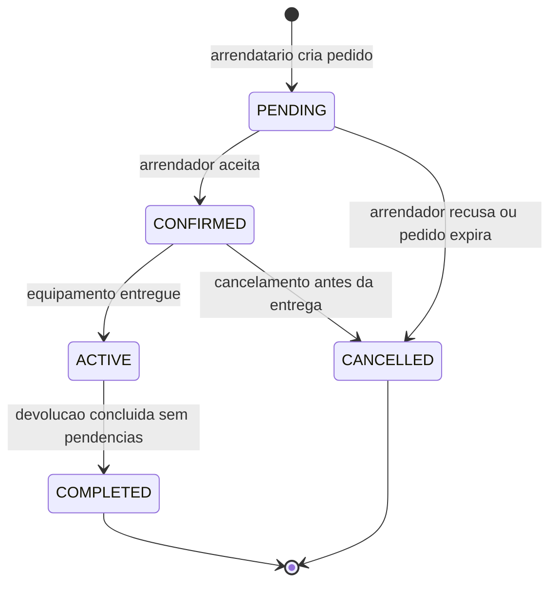
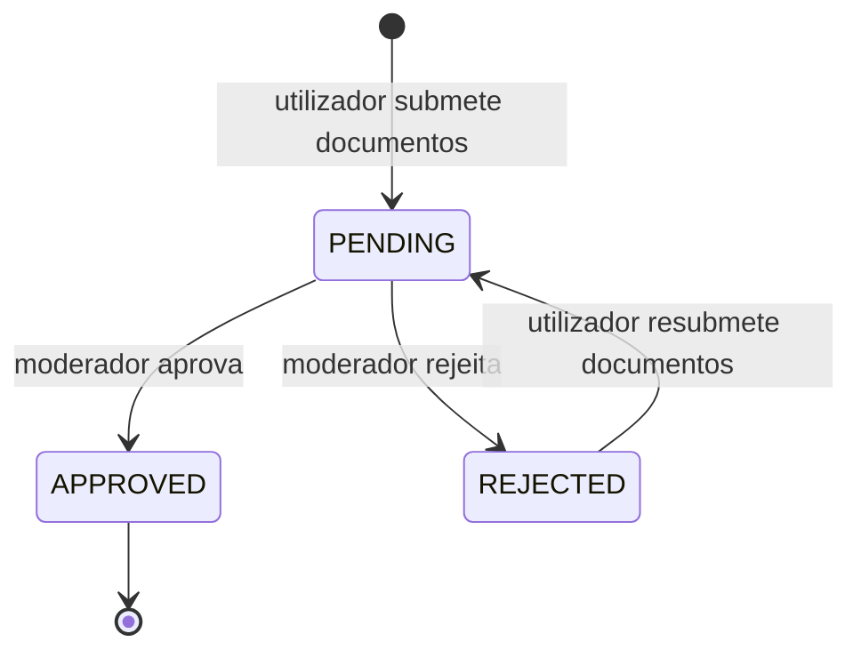
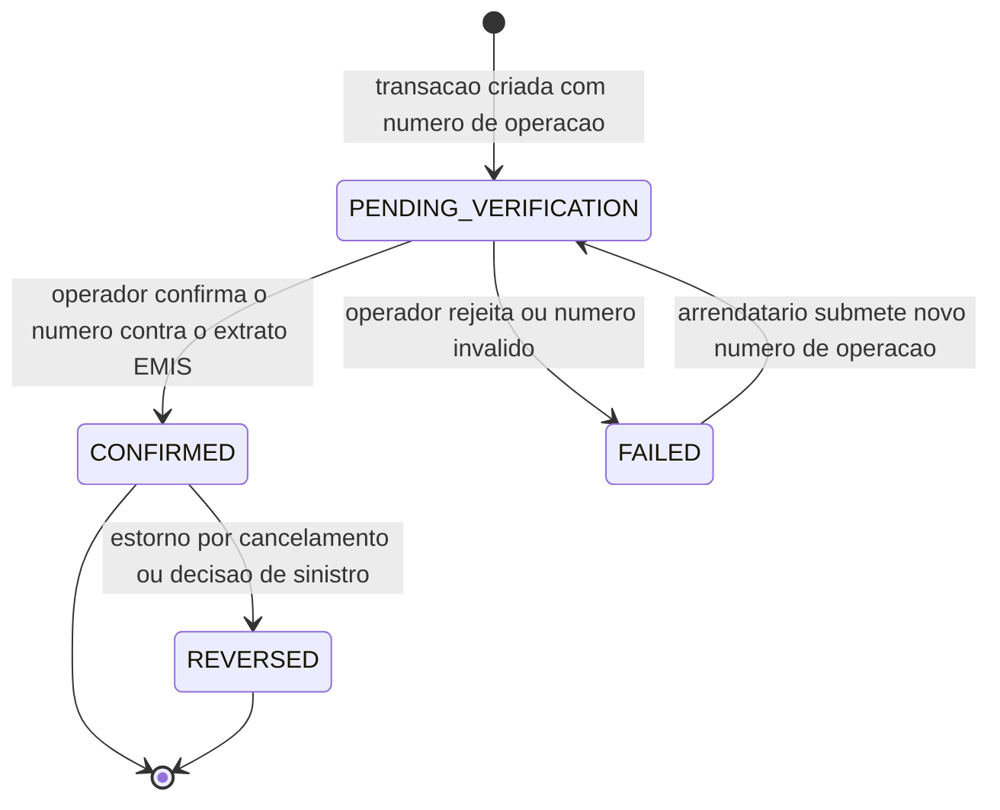
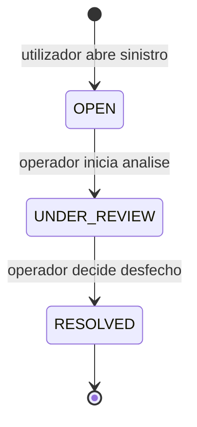
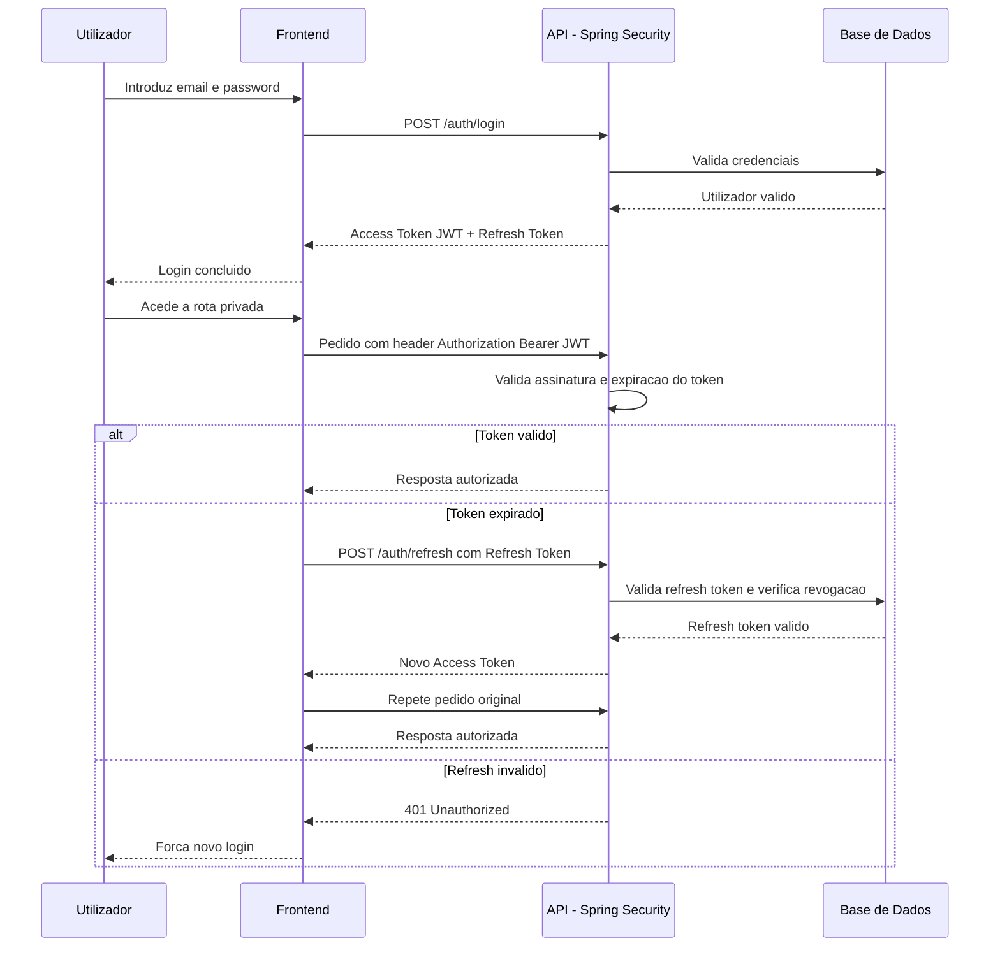
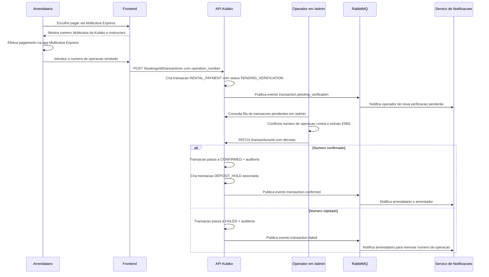
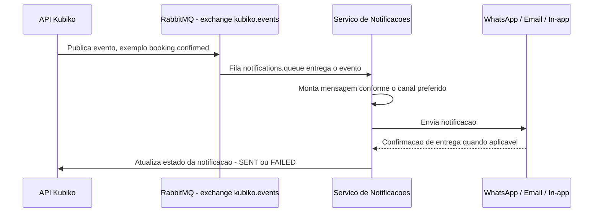

# Kubiko — Fluxogramas (Mermaid)

## 1. Fluxo Macro (Fase 0 → Fase 1 → Fase 2)

---

## 2. Fluxo Detalhado — Reserva e Checkout (Fase 2, MVP Transacional)

```mermaid
flowchart TD
    subgraph ARR[Arrendatario]
        A1[Pesquisa em /itens] --> A2[Abre /itens/id]
        A2 --> A3[Seleciona datas de aluguer]
        A3 --> A4[Sistema calcula preco por dia x dias + caucao]
        A4 --> A5[Confirma pedido de reserva]
    end

    A5 --> C1{JWT do arrendatario e valido?}
    C1 -->|Invalido ou expirado| C2[Redireciona para login]
    C1 -->|Valido| B1[Reserva criada com status PENDING]

    B1 --> D1[Evento booking.requested publicado no RabbitMQ]
    D1 --> D2[Notificacao assincrona entregue ao arrendador]
    D2 --> D3{Arrendador aceita ou recusa?}

    D3 -->|Recusa| E1[Reserva passa a CANCELLED]
    E1 --> E2[Auditoria: decisao registada - ator, motivo, timestamp]
    E2 --> E3[Evento booking.cancelled publicado - notifica arrendatario]

    D3 -->|Aceita| F1[Reserva passa a CONFIRMED]
    F1 --> F2[Auditoria: decisao registada]
    F2 --> F3[Redireciona arrendatario para /checkout/id]

    F3 --> G1[Arrendatario escolhe metodo de pagamento]
    G1 --> G2{Metodo escolhido}
    G2 -->|Multicaixa Express| H1[Sistema mostra numero Multicaixa da Kubiko e instrucoes]
    G2 -->|Metodo alternativo local| H2[Fluxo alternativo - a confirmar com produto]

    H1 --> I1[Arrendatario paga na app Multicaixa Express]
    I1 --> I2[Arrendatario introduz o numero de operacao recebido]
    I2 --> I3[Transacao RENTAL_PAYMENT criada com status PENDING_VERIFICATION]
    I3 --> I4[Evento transaction.pending_verification publicado no RabbitMQ]
    I4 --> I5[Operador e notificado e acede a fila de verificacao em /admin]
    I5 --> I6[Operador confirma o numero de operacao contra o extrato EMIS]
    I6 --> I7{Numero de operacao valido?}

    I7 -->|Sim| J1[Transacao passa a CONFIRMED]
    J1 --> J2[Auditoria: transacao verificada manualmente - ator, timestamp]
    J2 --> J3[Cria transacao DEPOSIT_HOLD - held_balance da conta atualizado]
    J3 --> J4[Contrato gerado automaticamente a partir da reserva]
    J4 --> J5[Evento transaction.confirmed publicado - notifica as duas partes]

    I7 -->|Nao| K1[Transacao passa a FAILED]
    K1 --> K2[Auditoria: transacao rejeitada - motivo]
    K2 --> K3[Notificacao ao arrendatario para reenviar numero de operacao]
    K3 --> G1
```

**Nota:** este é o fluxo temporário do MVP — a confirmação é manual porque a integração direta com a EMIS/Multicaixa Express ainda não existe. Quando essa integração ficar disponível, o passo I5–I7 (operador confirma manualmente) é substituído por um callback automático do gateway, sem alterar o resto do fluxo.

---

## 3. Fluxo Detalhado — Sinistro e Devolução de Caução

---

## 4. State Diagram — Reserva (Booking)

## 5. State Diagram — KYC

## 6. State Diagram — Transação (Ledger, tabela `transactions`)

Este único diagrama de estados serve para qualquer `type` de transação (`RENTAL_PAYMENT`, `DEPOSIT_HOLD`, `DEPOSIT_RELEASE`, `DEPOSIT_WITHHOLD`, `REFUND`, `PAYOUT`) — o `type` diz _o que_ o movimento representa, o `status` diz _em que ponto_ do ciclo de verificação está.

## 7. State Diagram — Sinistro (Claim)

---

## 8. Sequence Diagram — Autenticação (JWT + Spring Security)

---

## 9. Sequence Diagram — Pagamento via Multicaixa Express (verificação manual do número de operação)

Este fluxo é **temporário**: assume que a Kubiko ainda não tem integração direta (webhook automático) com a EMIS/Multicaixa Express, por isso a confirmação passa por um operador humano. Quando essa integração existir, o bloco "Operador confirma manualmente" é substituído por um callback automático do gateway — a tabela `transactions` e os eventos publicados não mudam.

---

## 10. Sequence Diagram — Mensageria Assíncrona (RabbitMQ) para Notificações

