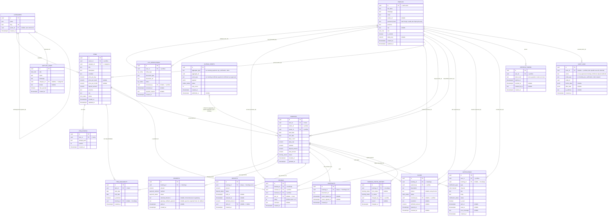

```mermaid
erDiagram

    %% ===================== IDENTIDADE & CONFIANÇA =====================
    PROFILES ||--o{ KYC_VERIFICATIONS : "submete (user_id)"
    PROFILES ||--o{ KYC_VERIFICATIONS : "reve (reviewed_by)"
    PROFILES ||--o{ REVIEWS : "escreve (reviewer_id)"
    PROFILES ||--o{ REVIEWS : "recebe (reviewee_id)"
    PROFILES ||--o{ ITEMS : "possui (owner_id)"
    PROFILES ||--o{ BOOKINGS : "aluga (renter_id)"
    PROFILES ||--o{ BOOKINGS : "disponibiliza (owner_id)"
    PROFILES ||--o{ CLAIMS : "abre (opened_by)"
    PROFILES ||--o{ CLAIMS : "resolve (resolved_by)"
    PROFILES ||--o{ NOTIFICATIONS : "recebe (user_id)"
    PROFILES ||--o{ REFRESH_TOKENS : "possui"
    PROFILES ||--o{ AUDIT_LOGS : "executa (actor_id)"

    %% ===================== CATÁLOGO & DISPONIBILIDADE =====================
    CATEGORIES ||--o{ ITEMS : "classifica"
    CATEGORIES ||--o{ CATEGORIES : "subcategoria de (parent_id)"
    CATEGORIES ||--o{ WAITLIST_LEADS : "interesse em"

    ITEMS ||--o{ ITEM_PHOTOS : "tem fotos"
    ITEMS ||--o{ ITEM_AVAILABILITY : "tem disponibilidade"
    ITEMS ||--o{ BOOKINGS : "e reservado em"
    ITEMS ||--o{ REVIEWS : "e avaliado em"

    %% ===================== TRANSAÇÃO =====================
    BOOKINGS ||--o{ ITEM_AVAILABILITY : "bloqueia datas"
    BOOKINGS ||--o{ PAYMENTS : "tem pagamentos"
    BOOKINGS ||--o| DEPOSITS : "tem caucao (1:1)"
    BOOKINGS ||--o| CONTRACTS : "tem contrato (1:1)"
    BOOKINGS ||--o{ REVIEWS : "gera"
    BOOKINGS ||--o{ CLAIMS : "pode gerar"
    BOOKINGS ||--o{ NOTIFICATIONS : "dispara (booking_id)"
    BOOKINGS ||--o{ BOOKING_STATUS_HISTORY : "regista historico"

    %% ===================== AUDITORIA / MENSAGERIA =====================
    OUTBOX_EVENTS }o--|| BOOKINGS : "referencia (aggregate_id quando aggregate_type = booking)"

    %% ===================== ENTIDADES =====================

    PROFILES {
        uuid id PK "-> auth.users"
        text full_name
        text whatsapp
        text email
        text avatar_url "nullable"
        text password_hash "hash bcrypt, usado pelo Spring Security"
        text province
        text city "nullable"
        user_role role
        boolean is_verified
        numeric rating_avg "nullable"
        timestamptz created_at
        timestamptz updated_at
    }

    REFRESH_TOKENS {
        uuid id PK
        uuid user_id FK "-> profiles"
        text token_hash "nunca guardar o token em claro"
        timestamptz expires_at
        timestamptz revoked_at "nullable"
        text created_by_ip "nullable"
        timestamptz created_at
    }

    KYC_VERIFICATIONS {
        uuid id PK
        uuid user_id FK "-> profiles"
        kyc_entity entity_type
        text document_type
        text document_url
        kyc_status status
        uuid reviewed_by FK "nullable, -> profiles"
        timestamptz reviewed_at "nullable"
        text rejection_reason "nullable"
        timestamptz created_at
    }

    REVIEWS {
        uuid id PK
        uuid booking_id FK "-> bookings"
        uuid reviewer_id FK "-> profiles"
        uuid reviewee_id FK "-> profiles"
        uuid item_id FK "nullable, -> items"
        int rating "CHECK entre 1 e 5"
        text comment "nullable"
        timestamptz created_at
    }

    WAITLIST_LEADS {
        uuid id PK
        lead_side side
        text name
        text whatsapp
        uuid category_id FK "nullable, -> categories"
        text details "nullable"
        boolean chat_opened
        timestamptz created_at
    }

    ITEMS {
        uuid id PK
        uuid owner_id FK "-> profiles"
        uuid category_id FK "-> categories"
        text title
        text description
        text condition
        numeric price_per_day
        numeric price_per_week "nullable"
        numeric price_per_month "nullable"
        numeric deposit_amount
        text province
        text city
        item_status status
        timestamptz created_at
        timestamptz updated_at
    }

    CATEGORIES {
        uuid id PK
        text name
        text slug UK
        uuid parent_id FK "nullable, auto-referencia"
        timestamptz created_at
    }

    ITEM_PHOTOS {
        uuid id PK
        uuid item_id FK "-> items"
        text storage_path
        int position
        timestamptz created_at
    }

    ITEM_AVAILABILITY {
        uuid id PK
        uuid item_id FK "-> items"
        date start_date
        date end_date
        boolean is_blocked
        uuid booking_id FK "nullable, -> bookings"
        timestamptz created_at
    }

    BOOKINGS {
        uuid id PK
        uuid item_id FK "-> items"
        uuid renter_id FK "-> profiles"
        uuid owner_id FK "-> profiles"
        date start_date
        date end_date
        int days_count
        numeric daily_rate
        numeric subtotal
        numeric deposit_amount
        numeric total_amount
        booking_status status
        timestamptz created_at
        timestamptz updated_at
    }

    BOOKING_STATUS_HISTORY {
        uuid id PK
        uuid booking_id FK "-> bookings"
        booking_status from_status "nullable"
        booking_status to_status
        uuid changed_by FK "-> profiles"
        text reason "nullable"
        timestamptz changed_at
    }

    PAYMENTS {
        uuid id PK
        uuid booking_id FK "-> bookings"
        numeric amount
        payment_method method
        payment_status status
        text external_reference "nullable, id da transacao no gateway"
        text gateway_callback_payload "nullable, guarda o payload bruto do callback"
        timestamptz paid_at "nullable"
        timestamptz created_at
    }

    DEPOSITS {
        uuid id PK
        uuid booking_id FK "unique, -> bookings (1:1)"
        numeric amount
        deposit_status status
        timestamptz held_at "nullable"
        timestamptz released_at "nullable"
        numeric withheld_amount "nullable"
        uuid claim_id FK "nullable, -> claims"
        timestamptz created_at
    }

    CONTRACTS {
        uuid id PK
        uuid booking_id FK "unique, -> bookings (1:1)"
        text document_url
        timestamptz owner_signed_at "nullable"
        timestamptz renter_signed_at "nullable"
        timestamptz created_at
    }

    CLAIMS {
        uuid id PK
        uuid booking_id FK "-> bookings"
        uuid opened_by FK "-> profiles"
        text description
        text photos "nullable, array de urls"
        claim_status status
        uuid resolved_by FK "nullable, -> profiles"
        text resolution "nullable"
        numeric withheld_amount "nullable"
        timestamptz opened_at
        timestamptz resolved_at "nullable"
    }

    NOTIFICATIONS {
        uuid id PK
        uuid user_id FK "-> profiles"
        uuid booking_id FK "nullable, -> bookings"
        notification_type type
        notif_channel channel
        text title
        text body
        notification_status status
        boolean is_read
        timestamptz sent_at "nullable"
        timestamptz read_at "nullable"
        text error_message "nullable"
        timestamptz created_at
    }

    AUDIT_LOGS {
        uuid id PK
        uuid actor_id FK "nullable, -> profiles (nulo quando acao do sistema)"
        text action "ex: kyc.approved, booking.confirmed, deposit.withheld"
        text entity_type "ex: booking, kyc_verification, claim, deposit"
        uuid entity_id
        jsonb before_data "nullable"
        jsonb after_data "nullable"
        text ip_address "nullable"
        timestamptz created_at
    }

    OUTBOX_EVENTS {
        uuid id PK
        text aggregate_type "ex: booking, payment, kyc_verification, claim"
        uuid aggregate_id
        text event_type "ex: booking.confirmed, payment.confirmed, kyc.approved"
        jsonb payload
        outbox_status status
        int retry_count
        timestamptz created_at
        timestamptz published_at "nullable"
    }
```
